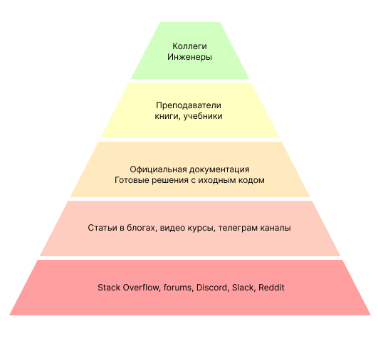

# Как самообучаться программисту

Привет, друзья. Сегодня хотел поднять одну извечно актуальную тему - обучение. Но не какого-то общего обучения и даже не "как войти в ИТ".

Хочу поделиться мнением и опытом по самообучению в профессии программиста. Т.к. занимаюсь этим почти всю жизнь и достаточно успешно. 
За многие годы я перепробовал практически все доступные способы и много общался с коллегами, наблюдал как они проходят этот путь.

## В чем собственно проблема?

Тема очень широкая, тут можно часами уходить в сторону и рассуждать над многими аспектами, но сегодня я поговорю о поиске источников информации или контента, если вы уже достаточно современный человек.

Итак, вы тем или иным способом занялись программированием. Не зависимо от того, каким путем вы пришли в эту профессию, получили высшее образование или в осознанном возрасте решили сменить профессию и переучились - суть одна, вам придется самообучаться всю оставшуюся профессиональную жизнь. И делать это регулярно, много и порой трудно преодалевая всё новые слои в познании дзена программирования.

Источников для самообучение на сегоднешний день очень много, не сравнимо больше чем было лет 20 назад, тем более если мы говорим про Советский Союз и СНГ. Т.е. говорить сегодня о доступности информации уже нет смысла, при минимальных усилиях вам будет доступна бесконечное количество материалов для изучения.

Медиум и легкость той или иной формы информации - это глубокая тема про психологию обучения и восприятия. Сегодня я не буду в это углубляться, но если будет интересно - можно порассуждать в будущем. Важно только запомнить, что люди категорически по-разному воспринимают и усваивают разные виды материала, кто-то хорошо воспринимает тексты и ему нужно, чтобы все было сформулировано и записано, другому человеку нужно обязательно инфо-графическое представление (этот человек я), а кому-то просто необходимо самому на практике пройти этот путь. В целом мы все способны использовать какой-то микс из способов восприятия, и сегодня мы можем с успехом найти именно такие источники.

Но самая главная вещь про которую я хотел рассказать сегодня - это ценность источников и уровень компетентности авторов. К сожалению и зачастую форма в медиа пространстве преобладает над содержанием, это закон жанра и метода передачи и восприятия. Часто выходит, что контент наиболее качественный по форме оказывается с низкой ценностью или становиться вредный, когда его воспринимают без критического осмысления.

## Пирамида компетентности и ценности

Я постарался уложить в небольшую модель идею о том, какие источники более ценны чем другие и дальше объясню, почему я так считаю. Но как и любая модель - это всего лишь один срез и источники могут быть полезны если их использовать правильно и всегда поддерживать здравый уровень критики.

### Stack-Overflow и сотоварищи

Начнем с низов. Когда то Stack-Overflow был просто кладезем знаний, где всегда можно было найти ответ на любую техническую проблему, даже стали говорить о SODD (Stack-Overflow Driven Development). К сожалению такие источники работают хорошо, только когда их аудитория мала и очень компетентна. Учитывая что количество разработчиков удваивается чуть ли не по закону Мура, каждые несколько лет - то сегодня Stack-Oveflow, как и всяческие каналы и форумы стали откровенной помойкой. Качество представленной информации ничтожно низкое и часто правильные ответы далеки от того, чтобы вообще иметь какой-то здравый смысл. И хотя до сих пор иногда там можно что-то подсмотреть на скорую руку, с каждым днем в этом все меньше смысла.

### Блоги, влоги и платформы

На смену хард-корным форумам и чатам пришел медиа контент, и если изначально этот способ облюбовали преподаватели из учебных заведений по всему миру, то сегодня уроки и видео-курсы уже прерогатива продюссерских коллективов, которым важны скорее законы жанра, удержание и развитие аудитории, привелечение новых подписчиков. Суть контента зачастую становиться на последние места. Не буду скрывать, есть и достаточно неплохие категории контента, обычно это дайджесты, обзоры и другой анализ, когда просмотр сохраняет много времени, чтобы сузить поле поиска или ознакомиться с какими-то решениями для расширения кругозора. Но как источник именно знаний для глубокого изучения и развития навыков - очень редко когда можно найти что-то ценное.
К тому же такой контент имеет неприятную проблему - актуальности. Дело в том что производство видео контента занимает много сил и времени, и обновлять материалы очень трудоемкое и дорогое дело. Поэтому часто авторы просто двигаются вперед не утруждаясь исправлять.
Похожая ситуация с блогами, тут законы жанра более лояльны к содержанию, но проблема актуальности также присутствует.

### Документация и исходники

Переходим к уже более полезным источникам. Официальная документация сегодня стала в разы лучше, это связано как с существенным развитием инструментов для ее создания, там и с растущим числом копирайтеров и технических писателей. В целом документация на сегоднешний день часто является наиболее актуальным и ценным источником знаний. Многие компании уделяют особое внимание, понимая что отличная документация - это огромное конкурентное преимущество (да, Microsoft, пора бы уже задуматься). Поэтому уменее работать с документацией, читать на аглийском, просто невероятное преимещество любого инженера.

Еще более ценным источником знаний, новых подходов, интересных или наоборот плохих решений является открытый исходных код. Тут надо только помнить, что сам по себе факт публикации исходного кода - не делает его хорошим и полезным, а автора экспертом. Но анализ исходного кода готовых решений по схожим проблемам развивает огромное количество навыков для инженеров любого уровня. И часто можно синтезировать именно ценные знания, которые не на одном форуме и видео курсе вы не найдете.

К сожалению, с документацией и исходным кодом мы уже в зоне дискомфорта для многих, особенно начинающих, инженеров. Чтение и анализ занимает больше времени и ментальных ресурсов, но и результат может намного превзойти ожидаемый. От себя отмечу, что это один из немногих способов именно пробить плато или свой стеклянный потолок, когда вам начинает казаться, что вы уже все выучили и дальше особо развиваться некуда.

### Преподаватели и учебники

У меня в какой-то период моей учебы и карьеры сложилось мнение, что учебники - это давно не актуальный материал, и документация или статьи в блогах куда более существенный источник. С годами я поменял свое мнение и уже будучи программистом с многолетним стажем часто возвращался к книгам 20-30 летней давности за ценными идеями и фундаментальными знаниями. Все-таки хорошая книга - это большой труд автора и редакторов, и ее ценность может быть гораздо глубже чем актуализация информации.
Конечно, это не относиться к книгам, которые представляют собой перепечатанную документацию.

Преподаватели тоже могут быть просто ценнейшим ресурсом знаний и умений, но тут надо быть осторожным. Если вы идете к преподавателю с курсов на модной платформе, то можно попасть на дилетанта с высоким самомнением. Но в целом многолетний опыт преподавания помогает накопить и кристализовать ценные знания и решения, которые могут быть очень полезны для инженеров и целых компаний для практического применения.

Так или иначе, большинство высоко-технологических стартапов - результат деятельности преподавателей и научных сотрудников ВУЗов.

### Коллеги

Ну и наконец, ваши коллеги или просто знакомые инженеры из других компаний. Если вам удастся найти хорошего инженера с богатым практическим опытом в решении сложный задач - это лучшее что вы сможете отыскать, как источник знаний. Конечно, если человек готов этим делиться.

Не всегда хорошие инженеры будут публичными личностями, часто они просто работают в свое удовольствие в крупных компаниях над сложными проблемами. Но если вам удастся поработать с Бобом Мартином или Джоном Кармаком - то это будет ценней любых книг, блогов и курсов. Конечно далеко не каждый работает в крупных компаниях с большим количеством первоклассных специалистов, но тем не менее, часто и в небольших компаниях можно найти неплохих инженеров. Да что там далеко ходить, у нас много отличных инженеров в Иванове, с которыми можно часами обсуждать интересные задачи и научиться многому, вне зависимости от уже имеющегося опыта.

## Заключение

В качестве заключения, хочу предложить вам попробовать использовать описанную модель на практике, хотя бы какое-то время и посмотреть, лучше ли стало двигаться ваше самообучение. Не спешите принимать решение из первого видео урока, поищите фундаментальные знания для вашей проблемы, поищите коллег, уже имеющих опыт с подобными задачами или просто почитайте повнимательней документацию и попробуйте найти свое решение.

Как всегда тема оказалось гораздо больше, чем мне хватило терпения и слов чтобы уместить ее в текст, поэтому если интересно что-то подобное или развитие темы обучения, пишите в соцсети, телеграмм или лично мне.
