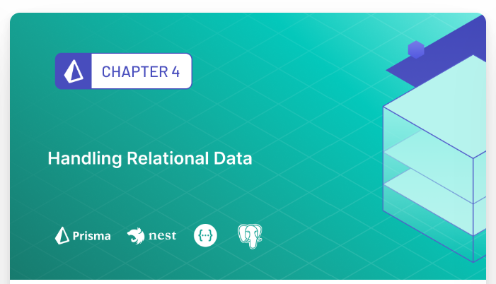
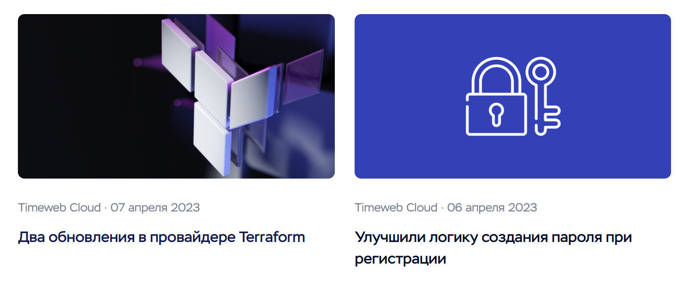
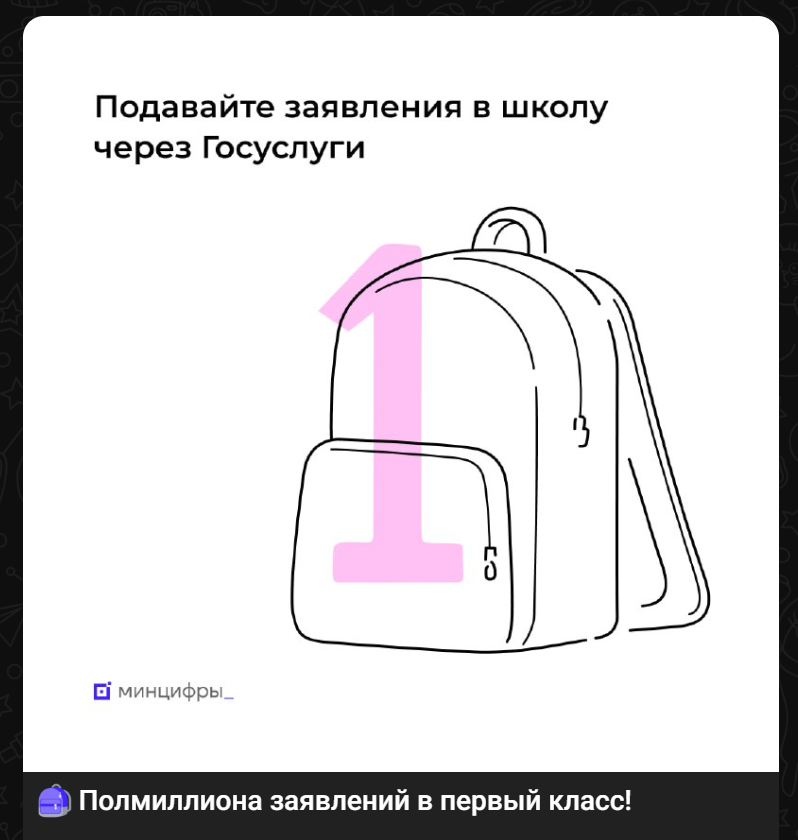
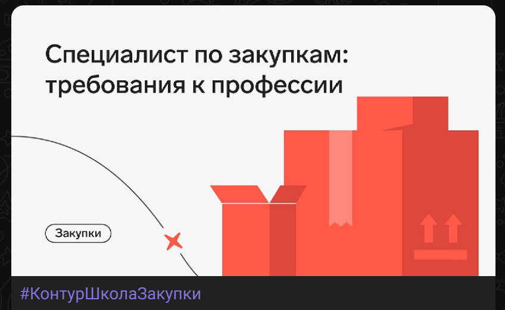
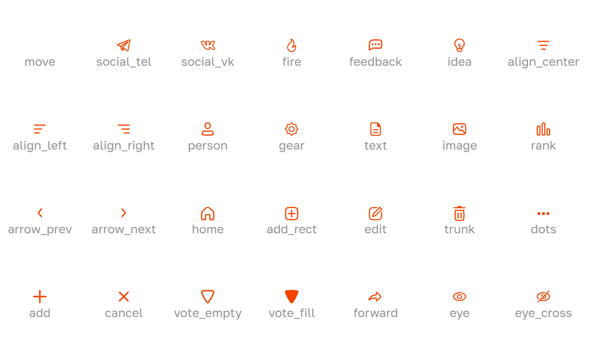

# Задачи для дизайнера

## Набор бейджей (достижений)

| | |
|-|-|
|**Размер задачи**  |небольшая  |
|**Приоритет**      |P0         |

Бейджи - это графические элементы, которые символизируют какие-то достижения. Выдаются пользователю на основе аналитики.

Для **Beta** весии нужны следующие бейджи:

- За польность выполненное задание Beta теста - выдатеся пользователю, который прошел все задания на бета тест и отметил их как завершенные.
- За создание 5 топиков (это максимум для Беты)
- За создание 20 блоков (любых в любых топиках)
- За подписку на 3 других топика
- За приглашение 5 друзей в топик

Пример бейджа:

Требования:
- Формат SVG
- Бейджи должны быть в одной стилистике
- Размер - достаточный, чтобы читались делали, за что выдан
- Желательно использование корпоративных цветов

## Набор (генератор) карточек для постов в соц. сетях и блоге

| | |
|-|-|
|**Размер задачи**  |небольшая  |
|**Приоритет**      |P1         |

Мы стараемся делать регулярные посты в блог и соц. сетях. Чтобы контент выглядел более консистемнтно и в едином стиле нужно разработать фреймворк для создания карточек.

Карточка - это картинка или фон для поста.

Пример карточек для блога:

Пример карточек для Телеграм:

Требования:
- Разработать стиль карточек
- Подготовить набор цветов и графика для постов (могут быть вектору или 3D геометрия)
- Разработать карточки для постов в [Блоге](https://gemforge.ru/blog)
- Разработать карточки для будущих постов в [Телеграм](https://t.me/gemforge)

Для Телеграма - можно согласовать набор в зависимости от контент плана. Будет несколько повторяющихся категорий. В каждой категории будет свой цветовой код, но разные графические элементы для разных постов.

## Лендинг "Топус"

| | |
|-|-|
|**Размер задачи**  |большая    |
|**Приоритет**      |P1         |

Разработать лендинг для сервиса [Topus](https://gemforge.ru/vote)

1. Разработать и согласовать структуру блоков для лендинга
2. Разработать визуальный стиль на основе продукта
3. Разработка финального дизайна в Figma для Desktop и Mobile

## Набор иконок для "Топус"

| | |
|-|-|
|**Размер задачи**  |среднаяя   |
|**Приоритет**      |P2         |

В данный момент у нас используется микс из иконок [Basic Icons](https://www.figma.com/community/file/931906394678748246/Basil-Icons) и собственных. Basil Icons имеют лицензию CC 4.0 - что позволяет нам использовать их в коммерческих целях.

Но, в будущем хотелось бы иметь свой, более брендированных и кастомный набор иконок.
Примерный список на текущий момент

