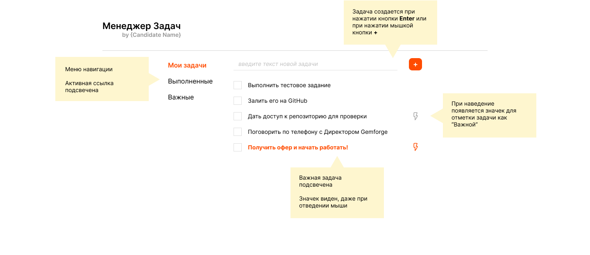
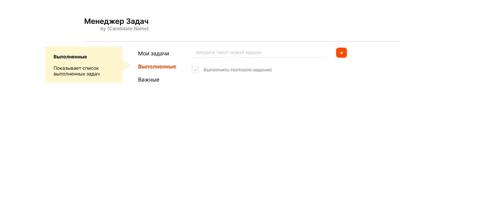
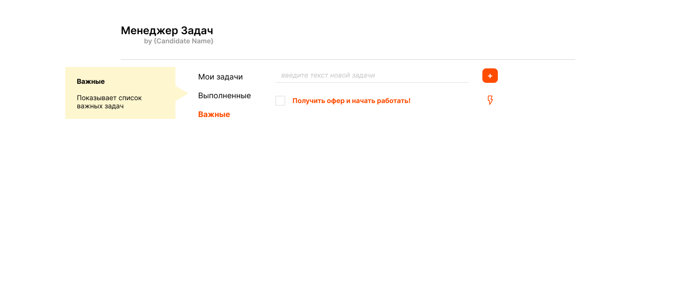
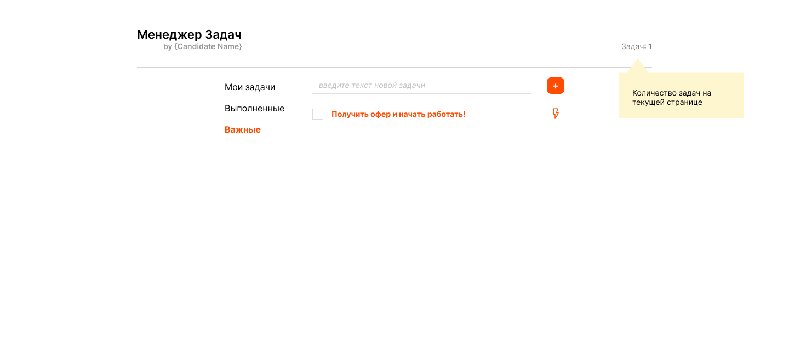

# Задание для разработчика Javascript / Full Stack

Привет, данный документ описывает домашнее задание, которое мы даем потенциальным кандидатам на должность full stack javascript разработчика.

Задание предполагает разработку серверной части на `nodejs` и клиентской части на `React` (можно на `Vue.js`, но если вы в будущем хотите перейти на `React`)

## Срок выполнения 
Задание примерно расчитано на **2-4 часа**, в зависимости от ваших навыков. Но мы не ограничиваем вас в затраченном времени. Это ваше время, но если вы хотите показать максимально на что вы способны, пожалуйста не сдерживайте себя!

## Формат выполнения
Мы принимает только репозитории на [GitHub](https://github.com/). Файл `README.md` в корневом каталоге должен содержать все инструкции, чтобы запустить тестовое приложение.

Используйте один репозиторий для клиента и сервера. Не нужно делать полноценный моно-репозиторий, просто напишите как запускать сервер и клиент.

### Зависимости
Пожалуйста используйте `npm` в качестве пакетного менеджера. (Вы можете любить `yarn` и `pnpm`, но пока будем консервативны)

Можно использовать сторонние пакеты и библиотеки, но постарайтесь не сильно усложнять стэк, чтобы можно было понять именно ваше решение. Оставайтесь прагматичными и используйте то, что больше подходит для решения конкретной задачи.

Например: Несколько обработчиков на `expressjs` будет легче прочитать чем разбираться в полноценном `nestjs` проекте

## Задание

Разработать сервер и клиент для небольшого приложения "Менеджер Задач"

### Архитектура

- Серверная часть представляет собой `REST API` сервис, работающий на `nodejs`, можно использовать какой-нибудь небольшой фреймворк
- Начальный набор данных можно задать в коде (`hard-code`), остальное хранить в памяти. Работу с постоянным хранилищем (базой или файлами) **не нужно**!
- Клиентская часть представляет собой `SPA` на `React`. Желательно использовать `Vite` для разработки и сборки. (не нужно `webpack`)
- Для общения клиента и сервера можете использовать, что вам больше нравиться, хотите просто `fetch`, а хотите `TanStack` `useQuery` (ну или что вам еще нравиться)

### UI

Суть приложения - простенький `ToDo` менеджер.

Основные компоненты:
- Заголовок, с указание имени автора (Вас)
- Панель навигации с ссылками на страницы "Мои задачи", "Выполненные" и "Важные"
- Основная панель задач

UI должен быть приближен к макету, но не нужно делать его `pixel perfect`. Соответстенно мы не даем в задании конкретные измерения (`red lines`), можно делать приблизительно. Тоже самое с цветами и шрифтами.

#### Мои задачи

#### Выполненные

#### Важные

Остальные требования:
- Пользователь может вводить текст новой задачи в `input`
- Создать задачу можно по нажатию `Enter` или клику по `+`
- По клику на `checkbox` задача переходит в состояние "Выполнена" и отображается в списке выполненных задач
- Выполненные задани не показываются в списке "Мои задачи" и "Важные"
- По клику на `checkbox` выполненной задачи, она переходит обратно в "ToDo"
- По наведению курсора на задачу, появляется значок "Важная" (молния)
- По нажатию на значок "Важная" задача становиться важной (подсвечивается) и отображается в списке важных
- По нажатию на значок "Важная" задачи, котороя уже "важная" - задача переходит обратно в обычное состояние

### Бонус задание
Если у вас будет время, можно добавить в заголовок индикатор, сколько задач на текущей странице.

## Связь

Если есть вопросы - пишите, не стесняйтесь. Процесс общения - это один из критериев отбора кандидатов, так что лучше общаться, чем пытаться додумать требования или понадеяться, что и так сойдет :)