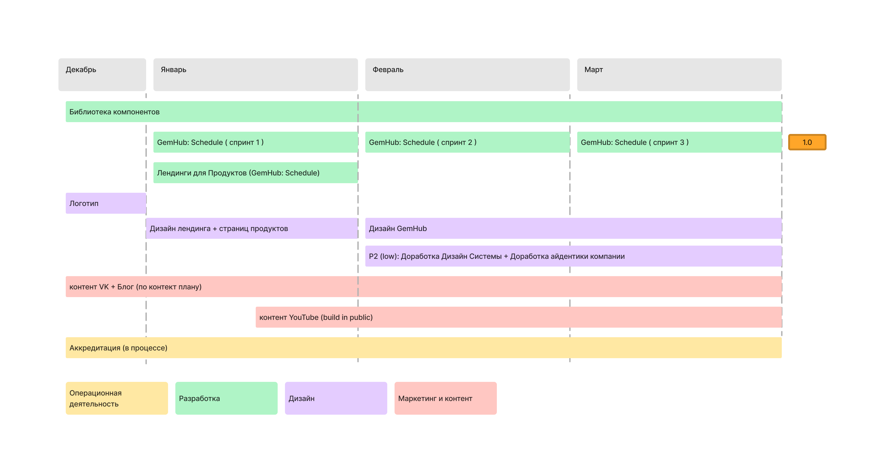

# Планы на первый квартал (Q1) 2023

На первый квартал у нас достаточно аггресивные планы, особенно в области маркетинга и контента.

## Разработка

Главной темой будет создание линейки сервисов интегрируемых между собой в полноценную Информационную Систему малого или микро предприятия.

**Целевая аудитория:** 
- Самозанятые, которые нужно быстрое решения, чтобы организовать их бизнес в онлайне (дополнение к ведению в Телеграме и Инстаграме)
- Микропредприятия, которым нужем набор сервисов, чтобы запуститься в онлайн и выстроить минимальную ИС
- Малый бизнес, кому необходимы различная функциональность, много разных сервисов, интеграция, аналитика, но нет возможности покупать дорогие корпоративные решения.

Причем на первом этапе **идеальный клиент** - это самозанятые (либо ИП), т.к. это самый цикл запуска и получения обратной связи - то, что нам нужно.

Примеры таких линеек сервисов:
- `Эвотор` - розничная торговля (интеграция внутри системы)
- `Контур` - управление предприятием (бухгалтерия, юридические сервисы, документооборот)
- `Яндекс` - продуктивность

`GemHub` - рабочее название

В разработке основной фокус будет на нескольких направлениях:

- `Gem UI Kit` - Библиотке компонентов и стилизации, будет постепенно наполняться по мере необходимости теми компонентами, которые мы разрабатываем для других проектов.
- `GemHub: Schedule` - Сервис "Расписание" для клиентов из категории частных школ, садов, а также микро пердпренимателей (обучение, фитнес, бьюти), бизнес которых связан с записью клиентов на какие то события (персональные или групповые занятия, встречи)
- `Identity Service` - Микро-сервис аутентификации и авторизации. Не сильно приоритетный, но необходимый сервис, который надо запустить до выпуска сервиса Расписание `1.0`

### Release management

Немного про запуск сервисов - основная идея тут в том, чтобы на циклиться на конкретном сроке или наборе функций (можно попать с ловушку `ещё одна фича`), а запускать как можно раньше и делать регулярные обновления с новыми фичами и исправлениями.

Продавать же сервисы и фичи нужно начинать еще до того, как они вообще сделаны.

---

## Дизайн

Главной темой будет формирование единого корпоративного стиля, как части общей будущей айдентики.
Из проектов у нас есть:
- Переработка логотипа
- Мерч, визитки
- Разработка единого стиля для иллюстраций к постам в Блоге и соц. сетях
- Дизайн лендинга с учетом подобранный шрифтов, цветов и форм
- Дизайн лендинга для продуктов (GemHub: Schedule)
- Добавление недостающих элементов в дизайн систему компании

---
## Маркетинг, PR и бренд

Основной фокус на расширении нашей аудитории в целом (не только потенциальные клиенты, но и сотрудники, партнеры), становлению и укреплению нашей репутации на рынке, внутреннему развитию (обучение, мероприятия, процессы).

В этом квартале отрабатываем процессы производства контента, прежде всего для нужд контент маркетинга, но и для PR в целом, для узнаваемости бренда. У нас есть предварительный контент план, который мы будет дорабатывать и устаканивать, чтобы нам было комфортно работать в определенном расписании производства.

Есть идея ипользовать `Build In Public` подход
> Build in Public - это подход к PR компании, когда разработка 
> продукты или сервиса освещается публично тем самым привлекая аудиторию еще в процессе создания.

По контенту несколько направлений:

1. Статьи для Блога и соц. сетей (VK) - то, что мы уже опробовали на пилотных постах, будем продолжать и развивать это направление. Надо выработать единый стиль для иллюстраций и визуальных материалов (диаграмм, данных).

2. Видео блог - план начать производство видео контента к концу Января. Возможно несколько треков:
  - Как происходит разработка ИТ систем в целом и у нас
    - Подходы: Agile vs Waterfall
    - Архитектура: микросервисы, монолиты, шины, брокеры
    - Управление данными
    - Облака, контейнеры
  - Обзоры на новости в ИТ (рынок, технологии, люди)
  - Новости наших продуктов и сервисов
    - Что нового
    - Анонсы

По рекламе - собрали уже немного данных, будет настраивать SEO, пробовать менять целевые запросы и в целом оптимизировать.

---
## Компания

Никаких особых изменений в работе в первом квартале не намечается.

Документы на аккредитацию поданы, ждем результатов на днях. Если что-то пошло не так - будет разбираться и подавать еще раз.

Возможно будет открыта позиция `DevOps` ближе к концу квартала, но это не точно.

В этом плане конечно желательно заранее знать, чтобы подготовиться, но пока будет смотреть на результаты первого квартала и решать нужно ли новые сотрудники ближе к Q2.
