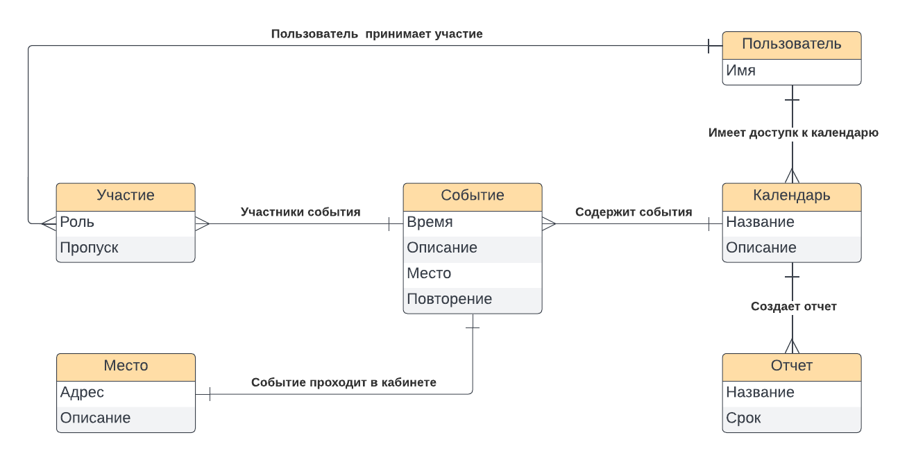

# Сервис Расписание

## Концепция

Легкий сервис, предоставляющий минимальную необходимую функциональность для создания и публикации событий в календаре, с возможностью онлайн записи на эти события по ссылке.

Основная концепция - что это быстрый и простой инструмент на каждый день, которые можно приспособить для разных целей, для личного календаря и интересных событий, для организации каких то групповых мероприятий или для целей ведения небольшого бизнеса.

Это в большей степени [Coda.io](https://coda.io), нежели MS Excel. Т.е. мы фокусируемся на наиболее универсальных функциях, чтобы не перегружать продукт функциональностью специфичной для того или иного бизнеса.

## Целевая Аудитория

Для начала мы стараемся охватить наиболее широкую аудиторию как физических лиц так и небольших владельцев своего дела, самозанятых, тем кому необходимо вести учет клиентов и событий, организовывать групповые занятия или праздники.

Однако мы не должны углубляться в курпные бизнес решения, например не фокусироваться на управлении салонами красоты или фитнес центрами. Это слишком тяжело и в каждом направлении много своей специфики.

Для малых и средних бизнесов мы будем выстраивать уже дальше основываюсь на линейке отдельных небольших сервисов и их интеграции между собой.

### Персоны

**Репетитор** - Алексей, репититор английского языка, у него есть основная работа в школе и 5-10 учеников для дополнительных занятий в вечернее время и выходные. Для каждого ученика есть какой то план на каждое занятие. Ведет он весь учет либо в Excel либо просто в чатиках.
Для него мы делаем удобный сервис для ведения нескольких учеников с возможностью задавать расписание занятий и добавлять описание (что выучить или принести) на каждое из них.

**Йога преподаватель** - Ирина, занимается йогой в свободное время, ведет групповые занятия на 15-20 человек по выходным. Вход по предварительной записи. Работает через чат в Вайбере. Для нее мы предоставляем сервис, чтобы удобно видеть наполняемость группы для занятия на предстоящие выходные. Она может менять описание, добавлять туда картинки, адрес.

**Многодетные родители** - личная боль. У каждого ребенка куча кружков и везде свое расписание. Надо все это запоминать, кого куда возить и какие материалы с собой брать. Решается случайно, чаты, записки, стикеры на холодильнике. Было бы удобно пользоваться сервисом расписания для того, чтобы организовать все в несколько календарей и наглядно представлять когда есть свободное время для записи на очередные мероприятия.

Индивидуальные барберы и маникюр мастера

## Минимальный Продукт

Цель - минимальный продукт - это версия которая содержит минимульную критическую функциональность (без которой сервис не может совсем работать).

В случае расписание, в минимальный продукт будет входить следующее:

**Регистрация**
  - Логин / Пароль
  - VK

**Администратор**
- (P0) Регистрация
- (P0) Создать новое расписание (тематический набор событий)
- (P0) Создание события
  - Карточка события
  - Описание (время, место)
  - Картинка или фон
  - Дополнительные блоки текста и ссылки
  - Количество участников и онлайн запись
- (P0) Управление событием
  - Отмена
  - Перенос на новую дату (с уведомлениями)
  - Удаление участника
- (P0) Рассказать про событие
  - Копировать ссылку
  - Ссылка для VK, Телеграм и Вайбер
- (P0) Лента активности
  - Уведомления о создании
  - Уведомления о записи
  - Коментарии на события
- (P0) Коментарии
  - Для события
- (P0) Поделиться расписанием по ссылке

**Пользователь**
- Регистрация
- Просмотр карточки события
  - Анонимно: нет коментариев, нельзя участвовать
  - Регистрация: можно всё
- Переход на календарь?
- Добавление вопроса\коментария к событию
- Отметка об участии
- Отказ от участия
- Пригласить (поделиться ссылкой)

Модель данных

## План

### Разработка

Разрабатываем MVP в виде веб сайта с использованием знакомого стека и библиотеки компонентов

Примерная дата запуска: **1 февраля 2023**

### Собрание обратной связи

Как только получаем что-то рабочее, начинаем раздавать всем знакомым и пользоваться самим, чтобы собрать как можно больше обратной связи и начать формировать сообщество.

Цели:
- репетиторы
- тренеры
- организаторы мероприятий

### Развитие

Планируем функциональность, чтобы покрыть максимально широкую аудиторию. Т.е. делает в первую очередь то, что могло бы быть использовано различными пользователями. Все более спецефическую функциональность оставляем либо для других сервисов из линейки (финансы, сервис скидок и бонусов, база знаний)
