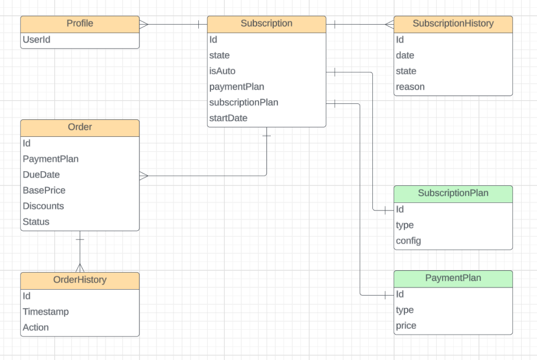

# Спецификация билинга (подписки, оплата)

## Введение

Для GemDoc мы будем использовать систему подписок ( `SaaS - Software as a Service` )

Такой подход с одной стороны предоставляет пользователю гибкость, сначала он может пользоваться бесплатной версией, а когда захочет использовать дополнительные фунекции - можно подписаться на один из платных планов.

Планы можно будет варьировать в зависимости от набора функционала и целевой аудитории. Так например можно разделить `персональные` и `корпоративные` планы, т.к. набор функций будет достаточно отличаться для одного человека и команды.

## Описание схемы данных

Следующая диаграмма представляет собой примерную схему данных



**Profile** - таблица с пользователями, привязка в профилю а не отдельный `userId` нужна, чтобы контролировать целостность данных, т.к. билинг это критически важные данные

**Subscription** - таблица с подписками. Подписка - это главная запись, котороая содержит информацию об активных и закрытых подписках пользователя. Пользователь может иметь только одну активную подписку в один момент времени. Но может иметь несколько предыдущих подписок - полезная информация для аналитики.

`id` - Идентификатор

`state` - Состояние подписки (см. ниже)

`isAuto` - Пользователь выбрал автоматически продлять подписку

`paymentPlan` - План оплаты (месячный, годовой, ..)

`subscriptionPlan` - План приложения: **Personal, Pro, Corporate**

`startDate` - Дата начала подписки, нужна чтобы мы могли понять когда выставлять следующий счёт

```ts
// Состояние Подписки
enum SubscriptionState {
  Placed: 0,
  Active: 1,
  Expired: 2,
  Paused: 3,
  Canceling: 4,
  Canceled: 5
}
```

**SubscriptionHistory** - история изменений подписки

**Order** - заказ. Таблица которая содержит информацию о выставленных счетах для пользователя. Пользователь оплачивает заказы либо вручную, либо автоматически если согласился на это. Интернет-эквайринг поддерживает автоматические платежи после того как пользователь заплатит первый раз.

**OrderHistory** - таблица истории заказа

---

**SubscriptionPlan** - Заранее сформированные планы подписок, доступные для пользователей. Т.к. они могут меняться со временем, при это пользователи остаются на старых планах, нам нежно хранить информацию о предыдущих. Так же тут можно хранить внутренние настройки по ограничениям и фичам, которые входять или нет в план.

**PaymentPlan** - Заранее сформированные планы оплаты с ценами, скидками для каждого варианта

## Процесс

Далее описано примерные процессы для разных сценариев:

### Подписаться
- Пользователь выбирает план подписки (SubscriptionPlan)
- Пользователь выбирает план оплаты (PaymentPlan)
- Система:
  - формирует подписку (Suscription)
  - формирует заказ (Order)
  - формирует историю (SubscriptionHistory, OrderHistory)
- Пользователь оплачивает "заказ"
- Система:
  - Отмечает заказ как оплаченный
  - Добавляет запись в инсторию
  - Активирует подписку
  - Отправляем нотификацию

### Продление
- Проверяем подписки каждый день
- Если пришло время платежа от начала подписаки в соответствии с планом
- Автопродление:
  - Создаем заказ
  - Списываем со счета
  - Отмечает заказ как оплаченый
- Без автопродления:
  - Создаем заказ
  - Отправляем пользователю уведомление об оплате
  - Пользователь:
    - оплачивает
  - Отмечает заказ как оплаченый

### Приостановка подкиски
- Условия:
  - подписка активна
  - заказ сформирован, но не оплачен
  - прошло Х дней (grace period)
- Помечаем подписку как просроченную
- Отправляем уведомление