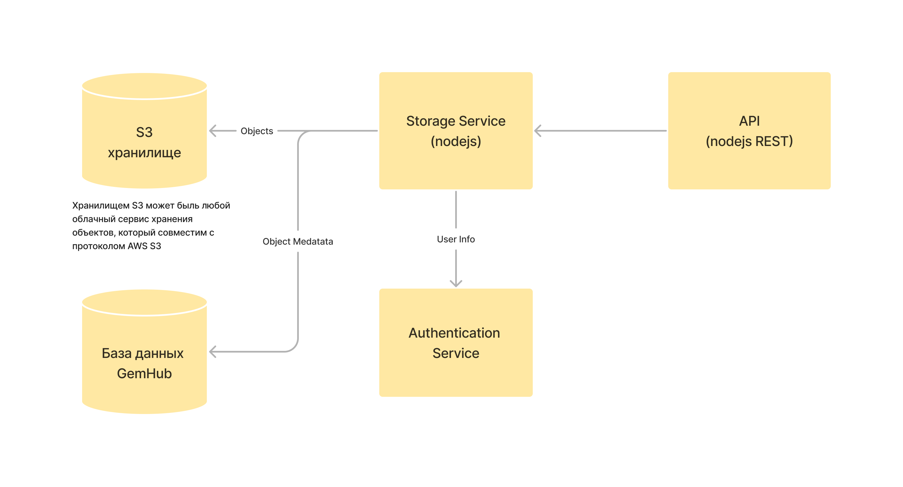

# Сервис загрузки и хранения фотографий

## Описание

Сервис представляет собой отдельный сервер, который имеет права доступа к облачному хранилищу объектов (совместимый с AWS S3) и может загружать и скачивать объекты (фотографии, документы, видео) в зависимости от прав доступа пользователя.

## Архитектура



Сами объекты будут храниться в облачном хранилище, которое совместимо с протоколом (и клиентской библиотекой) S3, наш текущих провайдер `Timeweb.cloud` поддерживает такое хранилище.

Т.к. данные будут конфидециальные для каждого пользовател, документы, картинки - то необходимо использовать `private` хранилище (не доступное для прямого доступа через интернет).

Для того чтобы загружать и скачивать такие объекты нужен отдельный сервис.
`Storage Service` - будет выполнять несколько операций:
- Проверять авторизирован ли пользователь для загрузки или скачивания. Через запрос к сервису аторизации.
- Управлять (создавать, менять, получать) метаданными объектов и их принадлежностью
- Загружать и скачивать сами объекты

Для использования сервиса из вебы нужно дополнительные методы в сервисе API. Но лучше сделать отдельные REST API для загрузки и доступа к файлам:
- GraphQL не поддерживает загрузку из коробки, потребуются дополнительные плагины. В данном случае graphql не дает никаких преимуществ в сравнении с REST API.
- Чтобы не перегружать сервер, картинки хорошо бы кэшировать через `Nginx`, поэтому из надо поместить на отдельные маршрут, чтобы можно было настроить в конфигурации.

## Технические детали

### Описание метаданных

Для каждго объекта нужно создать запись в таблице метаданных. Это нужно, чтобы можно было показывать в приложении информацию о файлах, их типах и даже некоторые детали.

---
`store_metadata`

| Поле      | Тип    | Вариант значеня  |
|-----------|--------|------------------|
| id        | UUID   | 2f2fff19-7ddb-4a63-9fe0-8696ea52a6d1 |
| type      | Int    | 1                |
| name      | String | my_profile.png   |
| desc      | String | Мой профиль 2023 |
| size      | Int    | 1.253.200        |
| state     | Int    | 1                |

`id` - идентификатор объекта, будет использован в других объектах для ссылки

`type` - тип файла из справочника

`name` - имя файла

`desc` - описание файл заданное пользователя

`size` - размер файла

`state` - состояние жизненного цикла файла (0: expected, 1: uploading, 2: uploaded, 3: archived)

### Права пользователя

Для выполнения операций с файлами пользователи должны быть аутентифицированы и иметь авторизацию для каждой отдельной операции.

Доступные скопы:

```
scopes:
    file:read
    file:write
    file:share
```

`file:read` - чтение объекта (загрузка и скачивание)

`file:write` - запись объекта (загрузка новых и перетирание старых объектов)

`file:share` - поделиться объектом - дать права доступа к объекту другому пользователю

## Тестирование
