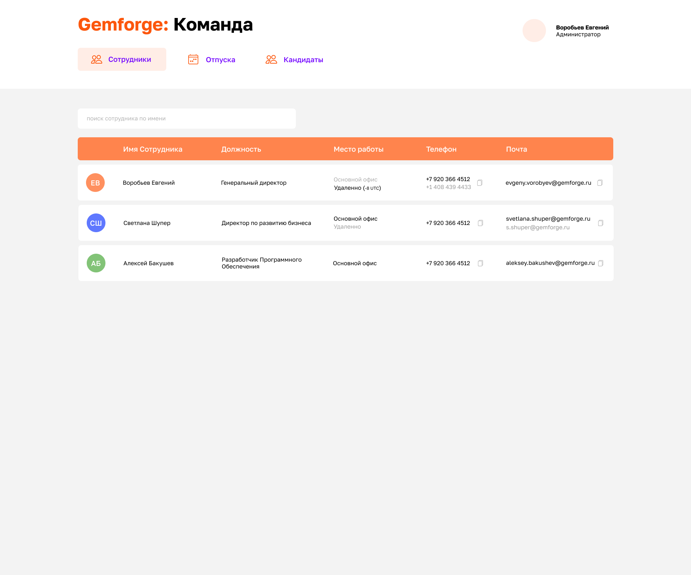
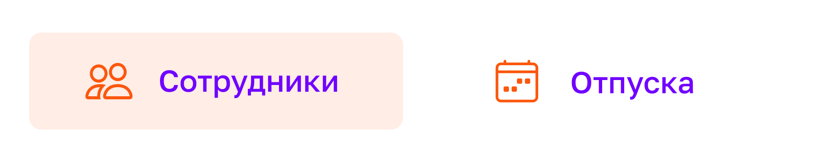

# Изучение фреймворка React

Итак, основным заданием на этот год будет изучение фреймворка React и связанных с ним технологий.

## Теория

Теорию можно изучать в любом виде

### Офичиальная документация

Официальная документация на сайте очень хорошая и есть на русском языке:
https://ru.reactjs.org/docs/hello-world.html

Тут важно понять одну особенность, `React` - это фреймворк для создания `UI`, а не полноценный фреймворк для web приложений. Его можно по разному использовать и встраивать в свое решение.

Я дальше опишу в практической части, как делать. Поэтому главу `Установка` в документации использовать НЕ надо.

### Полный курс по React
Наверное это будет самый просто способ двигаться вперед и не отвлекаться сильно на ненужные детали.

Главное балансировать теорию и практику.

### YouTube каналы
Можно смотерь любые видео на `YouTube`, но я бы рекомендовал смотреть только по конкретным проблемам. Видео где `учим React за 1 час` и подобное - обычно совершенно бесполезны и даже вредны.

## Практика

Теория - это хорошо, но самое главное - это объем и постоянство на практике. Это значит нужно каждый день заниматься именно практической работой хотя бы по 1-2 часа.

### Проект

Для практики давай делать сразу полезное приложение.

Назовем его `Gemforge: Команда` - это страничка, на которой можно будет видеть список всех сотрудников, их должности, контактные данные, занятость, отпуска. Дальше мы будем развивать это в полноценную систему по кадрам, куда сможем добавить открытые вакансии, поиск кандидатов и какие то сервисы по автоматизации справок. Но начнем с малого.

Основная функциональность:
- Спасибо сотрудников
  - табличка с основными данными и состоянием
- Выбор сотрудника в списке и открытие карточки сотрудника
- Карточка сотрудника - детальная информация, контактные данные

Дополнительная функциональность:
- Фильтрация по полям (`место работы`, `должность`, `проект`)
- Поиск по имени
- Календарь отпусков
- Открытые позиции и кандидаты

Приверный дизайн:



### Задачи на ближайшее время

#### 0. Внимательно изучить нашу внутреннюю документацию

- [Принципы и культурный код](https://docs.gemforge.ru)
- [Стратегия 2023](https://docs.gemforge.ru/2023)
- [Клиенты и Коммуникации](https://docs.gemforge.ru/clients)

Эти документы еще только готовятся, но все сотрудникам нужно будет обязательно изучить. Мы будем постоянно ссылаться на установленные приципы и на стратегию компании.

Поэтому можешь спокойно потратить столько времени, сколько потребуется, чтобы вдумчиво и внимательно изучить.

#### 1. Настроить сруду разработки и создать базовый проект

- Настроить компьютер и установить весь нужный софт:
  - nodejs
  - VSCode
  - git

- Создать акканут на [GitHub](https://github.com)
- Создать первый проект на [Vite](https://vitejs.dev/)
- Запустить и убедиться что все работает

#### 2. Начать разработку компонентов

Основная философия `React` в том, что все можно разделить на маленькие независимые компоненты. Поэтому и разработку даже большой страницы нужно начинать с разбивки на копоненты.

Для начала ты можешь начать работать на самыми простыми компонентами. Если в теоретическом курсе есть практические упражнения на создания каких то компонентов - не стоит это пропускать, потренируйся на них.

```
ВАЖНО:
- Мы будем использовать "только" функциональные компоненты. Если в курси или где-то ты увидишь про классовые компоненты - можешь спокойно пропускать, это устаревший способ.
- Мы будем использовать hooks для всех состояний и сайд эффектов.
```

Когда станет понятно, как делать простые копоненты - можно переходить к нашему проекту:

`Элемент навигации` - по сути контейнер с двумя элементами: Текстом и Иконкой. Он может быть в несколько состояниях: активный и пассивный.



`Запись о сотруднике` - можно пока просто сделать в виде нескольких значений представленных в виде строки

`Список записай о сотруднике` - вывести список записей о сотрудниках

дальше будем дополнять....